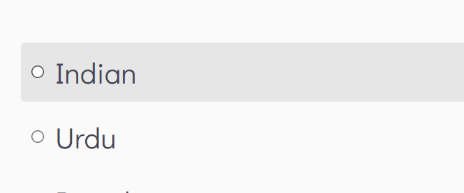
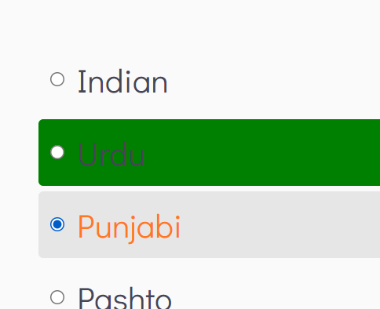
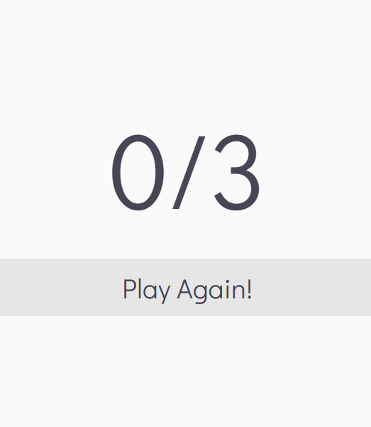
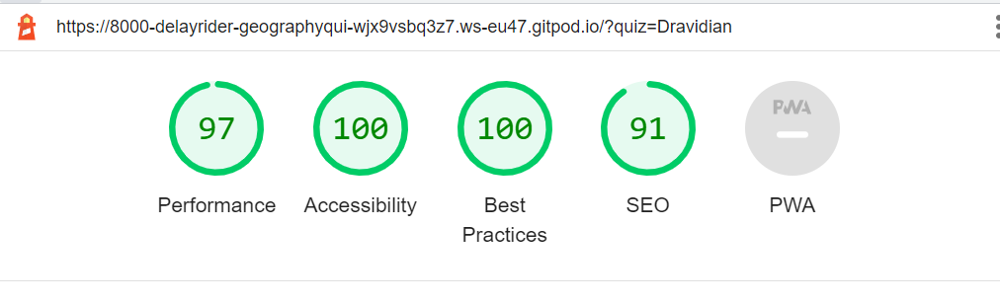
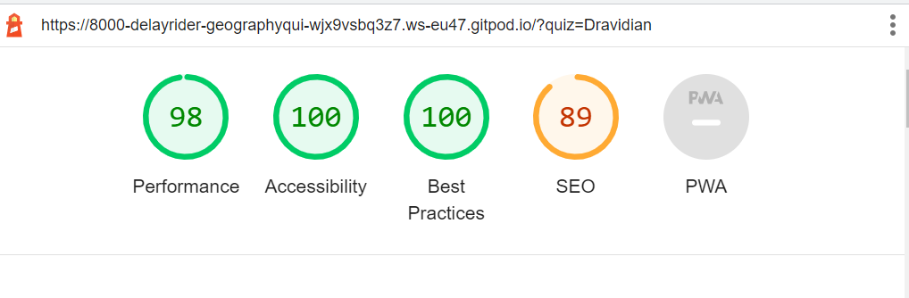

## How well do you know your planet? - Geography Quiz 
A Quiz for those who want to test their knowledge in geography.

Welcome to [GEORAPHY QUIZ]()!


# Table of Content
+ [User Experience](#user-experience)
  + [User Stories](#user-stories)
+ [Design](#design)
+ [Current Features](#current-features)
+ [Future Features](#future-features)
+ [Technologies Used](#technologies-used)
+ [Testing](#testing)
  + [Validator Testing](#validator-testing)
  + [Responsive Testing](#responsive-testing)
  + [Manual Testing](#manual-testing)
+ [Bugs](#bugs)
+ [Deployment](#deployment)
+ [Credits](#credits)
+ [Special Thanks](#special-thanks)


# User Experience
## User Stories
- Provides the user with a simple and intertaining game to test their knowledge on geography. 
- As this project was quite difficult for me to complete I left out some of the UX I had planned to concentrate on having a solid grasp on the js. 

# Current Features

- Pointer cursor
  Makes the site more user friendly by inciting the user to click on the different inputs.
- Background color change when hovering on buttons
  This provides the user feedback on his actions on the app. 

- If correct answer is selected it will turn green to give feedback to the user. 
  
- If an answer is selected, the font changes color.
  This gives the user feedback as to where he clicked

- Score counter gives user information on how many answers are correct against how many answers have been played.
  
- The "Next" buton allows the user to pass to the next question unambiguously.
- The "End" buton shows the user his final score.

- The "Play Again" button allows the user to start the game again.

# Future Features

- A more user friendly design.
- More engaging visuals.

# Technologies Used
- Languages used
  - HTML
  - CSS
  - JavaScript
- API
  - [Open Trivia API](https://opentdb.com/api_config.php) generated the questions and answers for my quiz

- Frameworks and programs
  - [Gitpod](https://gitpod.io/workspaces) for editing
  - [Github](https://github.com/) for storing and deployment
  - [Google Fonts¨](https://fonts.google.com/) for sourcing the fonts
  - [ColorPicker](https://imagecolorpicker.com/en) to create the palette of the website
  - [DevTools](https://developer.chrome.com/docs/devtools/) for testing while developping the site
  - [DevTools Lighthouse](https://developers.google.com/web/tools/lighthouse) to check performance, accessiblity, best practice and SEO ratings
  - [W3C Validator](https://www.stockvault.net/) to test HTML
  - [Jigsaw Validator](https://jigsaw.w3.org/css-validator/) to test CSS

# Testing

## Validator Testing

- W3C Validator
  - All four HTML pages came back with no errors
- Jigsaw Validator
  - CSS came back with no errors
- Lighthouse score for mobile
  - The original score for performance was 89 because the size of the touch navigation element was not big enough. The score was brough up by making these bigger.



- Lighthouse score for desktop
  - The original score for SEO was 79. The score was brought up by adding a description in the meta tags.




- Ran the js through [this](https://beautifytools.com/javascript-beautifier.php).


## Responsive Testing

The DevTools were used during the entire developpement to test responsiveness of the website. All the screen sizes available in DevTools were tested.

## Manual Testing

Manual testing was carried out on the website for all features

- Cursor: pointer
  - When hovering over the buttons, the cursor renders as a pointer
- Button background change on hover
  - All buttons change background color when user hovers over them
- Font color change on select
  - All multiple solutions change font color when selected
- New question loads when clicking next
- End page loads and shows the users score when clicked
- Correct answers against questions answered update as user plays

# Deployment 
- This project was developped using Gitpod, then commited to git and pushed to GitHub

The site was deployed to GitHub Pages from the repository by taking the following steps

  1. From GitHub navigate to the main page of the repository
  2. Select the "settings" cog underneath the repository name
  3. In the sidebad, under "code and automation" select "pages"
  4. Once in GitHub Pages select the publishing source from the dropdown menu
  5. Then click save
  6. The deployed site will update automatically with ever push made from Gitpod to GitHub

To run the code locally the following steps need to be taken
  1. From GitHub navigate to the main page of the repository
  2. Select the "code" button above the file list
  3. Choose HTTPS, SSH or GitHub CLI and click the clipboard incon to copy
  4. In your editor open the terminal
  5. Change the current working directory to the location where you want the cloned directory
  6. Type ```git clone``` and paste the URL you just copied
  7. Press "enter" to create you local clone


# Credits

- Tutorials and posts
  - [This](https://www.youtube.com/watch?v=qXXM9nVxLWk&t=855s) tutorial by [WEB CIFAR](https://www.youtube.com/c/WEBCIFAROfficial) was followed by steps. With certain implementations being unknown to me I relied on the tutorials below to grasp a full understanding of said features.
  - [This](https://careerkarma.com/blog/javascript-queryselector-vs-getelementbyid/#:~:text=With%20a%20querySelector%20statement%2C%20you,an%20element%20by%20its%20ID.) article by [James Gallagher](https://careerkarma.com/blog/author/jamesgallagher/) helped me understand and use confidently the ```querySelector``` function in JS. 
  - [This](https://developer.mozilla.org/en-US/docs/Web/JavaScript/Reference/Statements/const) article by [MDN Web Docs](https://developer.mozilla.org/en-US/) clarified what the ```const``` declaration is and how to use it. 
  - [This](https://www.youtube.com/watch?v=rJesac0_Ftw) tutorial by [LearnWebCode](https://www.youtube.com/user/LearnWebCode) cleared up the ```json``` and ```ajax``` format.
  - [This](https://dmitripavlutin.com/javascript-variables-best-practices/#:~:text=const%20is%20a%20one%2Doff,prefer%20const%20%2C%20otherwise%20use%20let%20.) article by [Dmitri Pavlutin](https://dmitripavlutin.com/) gave me insight on JS best practices. 
- Content
  - [Open Trivia API](https://opentdb.com/api_config.php) generated the questions and answers for my quiz.

- Media


# Special thanks

Special thanks to [StackOverflow](https://stackoverflow.com/) and all it's users for providing me with answers through the development process. Special thanks to the entire [Code Institute](https://codeinstitute.net/global/) team for making this possible. And a warm thanks to the amazing Slack community for their guidance and support.
